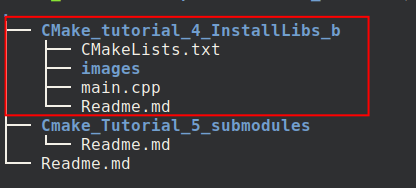

# Using submodules
This tutorial includes different reps on Github. In order to manage them indepedently, we define each of them as one rep.

Now, we use submodules to view them together but update them when each of them is modified and pushed.

##  How to add a submodule
We can simply add a submodule by running
```
git submodule add git@github.com:ZhongmouLi/CMake_tutorial_4_InstallLibs_b.git
```
After than, we can see 



which shows that the submodule of turotial_4 is added to our current folder.

This submudule infor is managed by git with the file *.gitmodules* 
```
[submodule "CMake_tutorial_4_InstallLibs_b"]
	path = CMake_tutorial_4_InstallLibs_b
	url = git@github.com:ZhongmouLi/CMake_tutorial_4_InstallLibs_b.git
```
It has only three kinds of info:
- what is the name of this submodule
- where is that located in the current folder
- what is the website of this submodule

